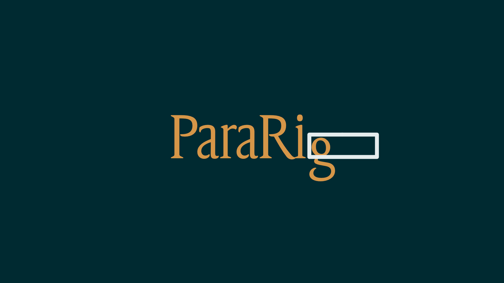
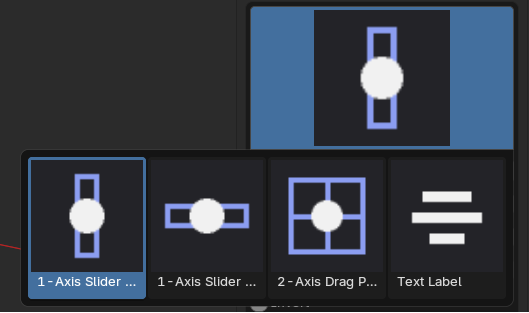
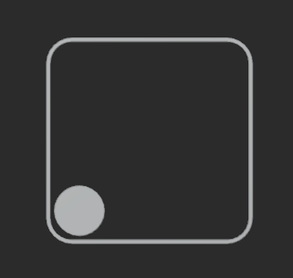

[English](README.en.md) | [繁體中文](README.md)

# 什麼是ParaRig？
這是一款能在3D視圖中自動生成、可直接拖動的整合控制器面板，讓你透過拖曳滑桿就能直接操控外形鍵、骨骼，或自訂資料，不用再一個個面板來回切換找數值。你只需要決定要哪些控制器、排在哪裡、綁定什麼資料，剩下麻煩的部分（做控制器外觀、設定驅動器、寫落落長的表達式）全部交給ParaRig處理。省下來的時間，拿去細雕動畫、多做幾個角色，或是來場愜意的下午茶。

# 特色
- 簡易且直覺的操作：新增、刪除、排序控制器全部都是清單點按鈕搞定，不用寫任何程式碼或表達式；設定完成後直接在3D視圖裡拖動控制器看效果，所見即所得，不用切來切去對照一堆面板上的數值。
- 非破壞性：在建立好面板之後，可以隨時回去新增、修改和刪除，只要在設定完成之後重新點一次更新就能完成控制器更新——更新是就地套用新設定，不是整組刪掉重建，所以已經生成的控制器如果手動調整過位置、大小等，這些調整都會被保留下來，不會因為改了其他設定就被打回預設狀態。
- 多種控制器樣式：內建直向滑桿、橫向滑桿、雙軸拖曳板、純文字四種樣式，可以依照需求選擇適合的控制器，不用再為了特別的需求去煩惱如何設定驅動器和表達式。
- 快速排版：可以使用拖移的方式快速安排每個控制器的位置，採用棋盤式排版，只要決定每個控制器要住幾樓，住誰隔壁，不用煩惱每層樓到底差了幾公分。
- 分組管理：同一個分組底下的控制器共享一個外框，可以整組一起移動、旋轉、縮放，也可以整組綁定到某個物體或骨骼上跟著角色走。

## 免費版 / Pro 版功能比較

ParaRig 另有付費的 **ParaRig Pro** 版本，包含下列額外功能：

| 功能 | 免費版 | Pro 版 |
| --- | :---: | :---: |
| 簡易且直覺的操作 | ✓ | ✓ |
| 非破壞性更新 | ✓ | ✓ |
| 多種控制器樣式（直向/橫向/2軸/純文字） | ✓ | ✓ |
| 快速棋盤式排版 | ✓ | ✓ |
| 分組管理與骨骼綁定 | ✓ | ✓ |
| 加長版滑桿樣式 | | ✓ |
| 多邊形混合控制器（口型混合等） | | ✓ |
| 匯入/匯出控制器組 | | ✓ |
| 快速資料填充 | | ✓ |
| 對稱資料填充 | | ✓ |
| 控制器複製 | | ✓ |
| 一對多資料控制 | | ✓ |
| 雙向分區資料控制 | | ✓ |
| 滑桿吸附端點 | | ✓ |
| 資料綁定自動命名 | | ✓ |
| 排版畫布縮放 | | ✓ |
| 分組「納入生成」開關 | | ✓ |

# 安裝
1. 到 [Releases](https://github.com/Zosuya/ParaRig/releases) 頁面下載 `para_rig-<版本>.zip`。
2. 來到 Edit > Preferences > Add-ons > Install from Disk，選取下載的 zip，啟用它就可以直接使用了。非常優雅（？
3. 打開 3D Viewport 的 N 面板，切到 **ParaRig** 分頁。

# 介面介紹
在這個外掛中，最常用到的就是在最上方的通用按鈕。

- 生成/更新滑桿控制器：在配置好控制器後，使用這個按鈕來進行第一次生成，或是在調整後使用此按鈕來更新已生成的控制器。
- 清除已生成的控制器：清除已經生成的所有控制器並刪除所有相關資料。

而在下面主要分為兩個，一個是**分組（group）**另一個是**控制器（sliders）**。其中控制器面板會是使用最多的地方。先來簡單介紹一下兩個面板的用途：

## 群組（group）
分組面板顧名思義，就是用來管理控制器要怎麼分組。每一個分組都是一組獨立的控制集合，同一個分組底下的控制器會共享同一個外框，一起移動、一起旋轉、一起縮放。如果場景裡有多個角色都需要各自的控制器面板，或是單一角色就需要拆成好幾組控制器來管理，都可以靠分組靈活應用。

- 清單：每一列代表一個分組，右側的「+」「-」新增/刪除分組，「▲」「▼」調整順序。
- 顯示外框：控制是否顯示群組外框。關閉後控制器本身還在，只是不畫外框矩形——此時會在原本外框左上角的位置畫一個小圓點當作原點標記，讓你在3D視圖裡仍然點得到、選得到這個分組（否則沒有任何幾何體可以點選）。
- 顯示分組名稱：選擇是否顯示群組名稱及控制文字大小。
- 綁定物件：選擇要將哪個物體作為父集，可選擇物體或是骨骼。
- 將此面板對準當前視圖：將控制器對準當前視圖畫面。

## 控制器（sliders）
控制器面板才是整個外掛真正的主戰場，這裡每一列代表一個實際會被生成出來的拖曳滑桿。你可以在這裡幫它取名字、決定它要歸在哪個分組底下、選擇要用哪一種控制器樣式（直向、橫向、雙軸、純文字）、要擺在排版棋盤的第幾格，最重要的是設定它到底要控制什麼——外形鍵、骨骼位置，或是自訂屬性都可以。全部設定好之後，點一次「生成滑桿綁定」，ParaRig就會照著你排好的清單，把滑桿外觀、外框、驅動器全部自動生成出來，不用你自己動手一個個做。之後不管是想新增、修改還是刪除，都可以隨時回來這裡調整，改完再點一次「更新滑桿綁定」就會套用最新設定，已經生成好的東西不會被打掉重練（例如你手動調過的位置、大小都會保留）。

- 編輯排版：在這裡可以將控制器進行排版。在下面設定好控制器後，可以在這邊使用拖曳的方式來安排控制器位置。要注意的是，編輯完成之後，要先**右鍵或是按ESC先退出**編輯排版才能操作其他地方，否則左鍵點擊可能不起作用。
- 顯示所有分組的控制器：開啟後可以看到在不同群組中的控制器。
- 篩選：可以過濾要在清單中要看到甚麼資訊（分組、目標物件、資料名稱三欄各自可以開關）。
- 清單：裡面摘要顯示所有滑桿的摘要資料等。每一列右側的「a」按鈕是「顯示名稱標籤」的快速開關。清單右側的按鈕由上到下分別是：
  - 「+」：新增一列控制器。
  - 「-」：刪除目前選中的控制器。
  - 「▲、▼」：上下移動選中的控制器，調整它在清單中的順序。
- 控制器名稱：這個名稱會決定在開啟「顯示名稱標籤」時所顯示的文字。
- 顯示名稱標籤：是否要在生成控制器中顯示名稱，後面數字決定文字大小。
- 所屬分組：透過這個清單可以改變控制器的所屬分組。
- 控制器樣式：

  

  點擊控制器圖示會展開樣式選擇器，直接點縮圖就能切換這個控制器要用哪一種樣式。各種樣式的實際外觀與用途請參照[控制器樣式](#控制器樣式)。

### 控制器樣式
為了因應各種綁定需求，ParaRig提供了四種不同類型的控制器樣式，可以依照資料需求來選擇適合的控制器。

無論選擇哪一種樣式，只要這個控制器有可拖曳的軸向，底下展開的「目標設定」都是同一組共通欄位：
- 目標類型：選擇要綁定的資料類型，可以選擇外形鍵、自訂屬性或是骨骼位置。
- 目標物體：選擇資料實際所在的物體，例如要控制外形鍵就選該外形鍵所屬的模型，要控制骨骼位置就選對應的骨架。
- 資料名稱：輸入或選擇實際要控制的資料。目標類型是外形鍵時，這裡會直接列出目標物體現有的外形鍵清單可供選擇；是自訂屬性時，手動輸入屬性名稱即可；是骨骼位置時，改為顯示骨骼名稱與骨骼軸向欄位。
- 最小值 / 最大值：拖曳到行程兩端時，實際要送給目標資料的數值範圍。
- 反轉：把拖曳方向對應的數值範圍反過來。

#### 單軸控制器(直向/橫向)
這是最通用的控制器樣式，有分為直向和橫向，只有一個拖曳軸，直接使用上方的目標設定即可。直向滑桿往上拖數值變大、橫向滑桿往右拖數值變大。

#### 雙軸控制器(XY)

可以在平面上自由拖曳，X、Y兩個方向各自獨立展開一組上方的目標設定，一顆控制器就能同時驅動兩種資料變化。

#### 純文字
不會生成任何可拖曳的控制器，也不驅動任何資料（沒有上方的目標設定），單純用來在排版棋盤上放一段文字說明或分類標題。
- 文字大小：設定顯示的文字大小。

# 基本工作流程
1. **建立分組**：在分組面板點一下「+」新增一個分組，這是等一下要生成的這批控制器共用的容器，之後可以整組一起移動、旋轉、縮放。或是直接新增控制器也可以，分組會自動生成。
2. **新增控制器**：切到控制器面板，同樣點「+」新增一列，取個看得懂的名字，選好要用哪一種控制器樣式（直向滑桿、橫向滑桿、雙軸、純文字依需求選）。
3. **綁定資料**：展開這一列的細節設定，選擇要控制的資料類型——外形鍵、骨骼位置，或自訂屬性，指定實際要綁定的那一筆資料，並設好數值範圍（min/max）。
4. **安排排版**：用「編輯排版」直接在3D視圖裡用拖曳的方式，把每個控制器擺到棋盤的第幾格，不用自己手動輸入座標。
5. **生成**：全部設定好之後，按下「生成滑桿綁定」，ParaRig會自動把外框、滑桿、驅動器全部建好，直接出現在3D視圖裡。
6. **測試與調整**：直接在3D視圖拖曳控制器看效果，不滿意就回控制器面板改設定，改完再按一次「更新滑桿綁定」套用最新設定——已經手動調整過的位置、大小都不會受影響。

# 系統需求
- Blender 4.2 以上，已在 4.5 LTS 與 5.2 LTS 兩個版本上完整測試過。

# 常見問題 / 疑難排解
**改了某些設定，但畫面沒有跟著更新？**
大部分設定用「更新滑桿綁定」就會即時套用，不會動到你手動調整過的位置/大小；如果是更新到新版 ParaRig 之後外觀沒有變成新版樣子，先按一次「清除已生成的滑桿」再「生成滑桿綁定」重新建立。

**分組被我刪掉了，底下的滑桿變成顯示「(未指定分組)」？**
刪除分組不會連動刪掉底下的滑桿，只是滑桿失去對應的分組——這是刻意的保護設計，避免手滑刪一個分組就整批資料一起消失。回控制器面板重新指定分組即可。

**關掉「顯示外框」之後，在3D視圖裡點不到這個分組？**
關閉外框時會在原本外框左上角的位置留下一個小圓點當作原點標記，點它就可以選到這個分組。如果連小圓點都找不到，也可以從Outliner或用Shift+G選父層。

**按下「清除已生成的控制器」按鈕後，控制器沒有正確清理乾淨怎麼辦？**
生成的控制器會統一放在ParaRig的集合中，可以直接刪除整個集合，維持資料乾淨。

# 版本紀錄
### v1.0.0
- 首個正式版本。核心的滑桿生成/驅動器綁定管線、分組系統、棋盤式排版與編輯排版畫布、四種控制器樣式（直向/橫向/雙軸/純文字）、名稱標籤、非破壞性更新皆已完備並經過測試
- 修正改綁目標後舊目標殘留孤兒 Driver 的問題
- 修正橫向滑桿的拖曳方向：最小值/0 現在在左邊、最大值在右邊
- 關閉「顯示外框」時，改在原本外框左上角畫一個原點標記，讓分組在3D視圖裡仍然選得到
- N 面板改為「分組」/「控制器」兩頁切換，控制器清單每列加上樣式圖示與名稱標籤快速開關
- Track/外框加上圓角，名稱標籤間距調整避免壓到外框

# 授權 / 使用條款
ParaRig 採用 **GPL-3.0-or-later** 開源授權，可以自由使用（含商業用途）、修改與再散布——完整條款見 [`LICENSE`](LICENSE)。
