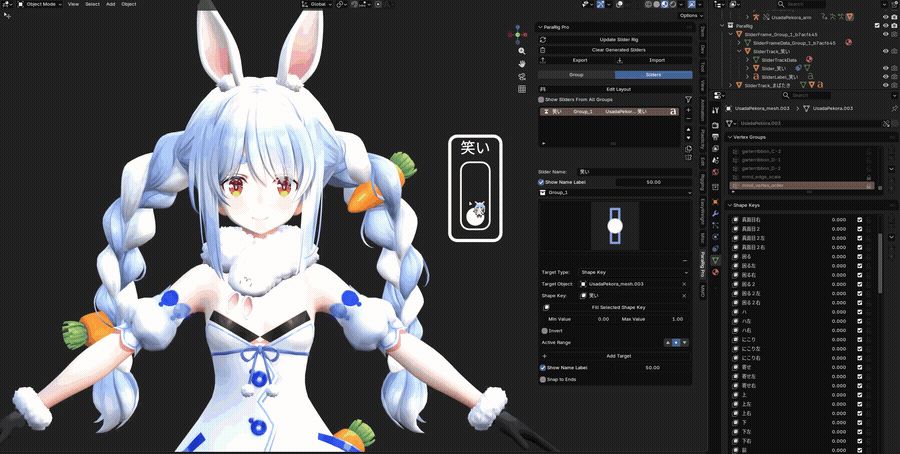
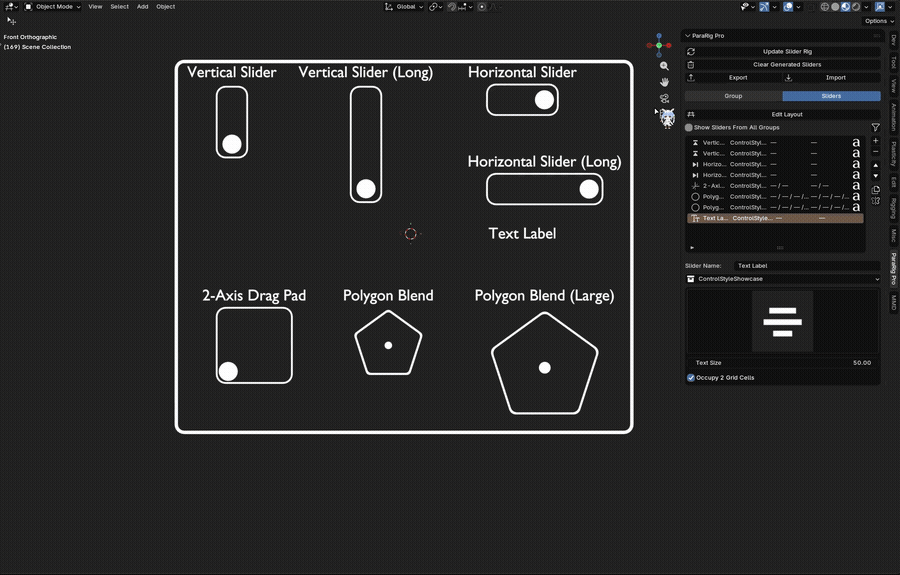
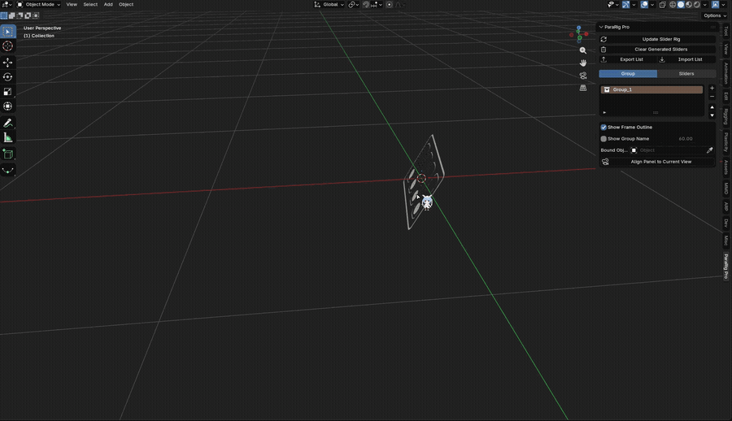

[English](README.md) | [繁體中文](README.zh-TW.md)

# What is ParaRig?
ParaRig auto-generates a draggable control panel right inside the 3D Viewport, letting you drive Shape Keys, bones, or custom properties just by dragging sliders — no more hopping between panels hunting for values. You decide which controls you want, where they go, and what data they drive; ParaRig handles all the tedious parts (building the control widgets, setting up Drivers, writing those long expressions). Spend the time you save polishing your animation, rigging another character, or on a well-earned afternoon tea.

# Features
- **Simple and intuitive**: adding, deleting, and reordering controls is all done by clicking buttons in a list — no code, no expressions. Once configured, drag the controls directly in the 3D Viewport to see the result. What you see is what you get, with no flipping back and forth to cross-check numbers on a pile of panels.
- **Non-destructive**:

  

  After your panel is built, you can go back and add, edit, or remove things at any time — just hit update once you're done. Updates are applied in place rather than deleting and rebuilding the whole set, so any manual tweaks you've made to a generated control (position, size, and so on) are preserved instead of being reset because you changed something else.
- **Multiple control styles**: four built-in styles — vertical slider, horizontal slider, 2-axis drag pad, and text label. Pick whichever suits your data, without having to work out Driver setups and expressions for special cases.
- **Fast layout**:

  

  Arrange every control by dragging, on a checkerboard-style grid. You only decide which "floor" each control lives on and who its neighbours are — no working out how many centimetres apart each row should be.
- **Group management**: controls in the same group share one Frame, so they move, rotate, and scale together. A whole group can also be bound to follow an object or bone along with your character.

# Installation
1. Download `para_rig-<version>.zip` from the [Releases](https://github.com/Zosuya/ParaRig/releases) page.
2. Go to Edit > Preferences > Add-ons > Install from Disk, select the downloaded zip, and enable it. Very elegant (?
3. Open the N-panel in the 3D Viewport and switch to the **ParaRig** tab.

# Interface
The buttons you'll use most sit right at the top of the panel.

- **Generate / Update Slider Rig**: use this for the first generation once your controls are configured, or to update already-generated controls after making changes.
- **Clear Generated Sliders**: removes every generated control and all its associated data.

Below that, the panel is split into two pages: **Group** and **Sliders**. The Sliders page is where you'll spend most of your time. Here's what each one is for:

## Group
The Group page is, as the name suggests, for managing how your controls are grouped. Each group is an independent set of controls: everything in the same group shares one Frame and moves, rotates, and scales together. If your scene has several characters that each need their own control panel, or a single character that's easier to manage split across several sets of controls, groups give you that flexibility.

- **List**: each row is one group. The `+` / `-` buttons on the right add and remove groups, and `▲` / `▼` reorder them.
- **Show Frame Outline**: controls whether the group's Frame outline is drawn. When off, the controls themselves are still there — only the outline rectangle is skipped. In that case a small dot is drawn where the outline's top-left corner would have been, as an origin marker, so you can still click and select the group in the 3D Viewport (otherwise there'd be no geometry to click at all).
- **Show Group Name**: whether to display the group's name, plus a field for the text size.
- **Bound Object**: pick an object to act as the parent — either an object or a bone.
- **Align Panel to Current View**:

  

  Orients the controls to face your current viewport view.

## Sliders
The Sliders page is where the real work happens. Each row here is one draggable slider that will actually be generated. You can name it, decide which group it belongs to, choose its control style (vertical, horizontal, 2-axis, or text label), and set which grid cell it occupies — and most importantly, configure what it actually drives: a Shape Key, a bone location, or a custom property. Once everything is set, click **Generate Slider Rig** and ParaRig builds the slider visuals, the Frame, and the Drivers automatically from your list, so you don't have to make them one by one. You can come back and add, edit, or delete entries at any time; clicking **Update Slider Rig** applies your latest settings without tearing down what's already generated (manual tweaks to position and size are preserved).

- **Edit Layout**: lay out your controls here. Once they're configured below, you can drag them into place. Note that when you're done you must **right-click or press ESC to exit** Edit Layout before you can interact with anything else — otherwise left-clicks may not register.
- **Show Sliders From All Groups**: turn this on to see controls belonging to other groups as well.
- **Filter**: choose which columns appear in the list (group, target object, and data name can each be toggled).
- **List**: shows a summary of every slider. The `a` button on the right of each row is a quick toggle for "Show Name Label". The buttons down the right-hand side of the list are, from top to bottom:
  - `+`: add a new control row.
  - `-`: delete the currently selected control.
  - `▲` / `▼`: move the selected control up or down to reorder it in the list.
- **Slider Name**: this name is what gets displayed when "Show Name Label" is enabled.
- **Show Name Label**: whether to display the name on the generated control; the number beside it sets the text size.
- **Group**: use this dropdown to change which group the control belongs to.
- **Control Style**:

  

  Clicking the control icon opens the style picker — click a thumbnail to switch this control to that style. For what each style looks like and what it's for, see [Control Styles](#control-styles).

### Control Styles
To cover a variety of binding needs, ParaRig offers four different control styles — pick whichever fits the data you're working with.

Whichever style you choose, as long as the control has a draggable axis, the "target settings" that expand underneath are the same common set of fields:
- **Target Type**: the kind of data to bind — Shape Key, custom property, or bone location.
- **Target Object**: the object the data actually lives on. For a Shape Key, pick the mesh that owns it; for a bone location, pick the corresponding armature.
- **Data Name**: the specific piece of data to drive. When the target type is Shape Key, this lists the target object's existing Shape Keys to choose from; for a custom property, type the property name manually; for a bone location, this becomes bone name and bone axis fields instead.
- **Min Value / Max Value**: the value range actually sent to the target data at each end of the drag travel.
- **Invert**: flips the value range relative to the drag direction.

#### 1-Axis Slider (Vertical / Horizontal)
The most general-purpose style, available in vertical and horizontal variants. It has a single drag axis and uses the target settings above directly. Dragging a vertical slider up increases the value; dragging a horizontal slider right increases the value.

#### 2-Axis Drag Pad (XY)

Drag freely across a plane. The X and Y directions each expand their own independent copy of the target settings above, so one control can drive two different data changes at once.

#### Text Label
Generates no draggable control and drives no data (it has no target settings). It's purely for placing a line of explanatory text or a category heading on the layout grid.
- **Text Size**: sets the displayed text size.

# Basic Workflow
1. **Create a group**: click `+` on the Group page to add one. This is the shared container for the batch of controls you're about to generate, and it can be moved, rotated, and scaled as a unit afterwards. You can also just add a control directly — a group will be created automatically.
2. **Add controls**: switch to the Sliders page, click `+` to add a row, give it a recognisable name, and pick a control style (vertical slider, horizontal slider, 2-axis, or text label, as needed).
3. **Bind the data**: expand that row's detail settings, choose the data type to drive — Shape Key, bone location, or custom property — specify the exact piece of data to bind, and set the value range (min/max).
4. **Arrange the layout**: use **Edit Layout** to drag each control into its grid cell directly in the 3D Viewport, instead of typing coordinates by hand.
5. **Generate**: once everything is configured, click **Generate Slider Rig**. ParaRig builds the Frame, sliders, and Drivers automatically, and they appear right in the 3D Viewport.
6. **Test and adjust**: drag the controls in the 3D Viewport to see the result. If something's off, go back to the Sliders page, change the settings, and click **Update Slider Rig** again to apply them — any positions and sizes you adjusted by hand are left untouched.

# Requirements
- Blender 4.2 or newer. Fully tested on 4.5 LTS and 5.2 LTS.

# FAQ / Troubleshooting
**I changed some settings but the viewport didn't update.**
Most settings apply immediately via **Update Slider Rig**, without disturbing positions and sizes you adjusted by hand. If you've updated to a newer version of ParaRig and the visuals haven't changed to the new look, click **Clear Generated Sliders** once and then **Generate Slider Rig** to rebuild them.

**I deleted a group and now its sliders show "(No Group Assigned)".**
Deleting a group does not delete the sliders under it — they simply lose their group association. This is a deliberate safeguard so that one accidental deletion doesn't wipe out a whole batch of data. Just reassign the group on the Sliders page.

**I turned off "Show Frame Outline" and now I can't click the group in the 3D Viewport.**
With the outline off, a small dot is left where the outline's top-left corner would have been, as an origin marker — click it to select the group. If you can't find even the dot, you can also select it from the Outliner or use Shift+G to select the parent.

**I clicked "Clear Generated Sliders" but the controls weren't cleaned up properly.**
All generated controls are placed in the "ParaRig" collection, so you can simply delete that entire collection to keep your data tidy.

# Changelog
### v1.0.0
- First stable release. The core slider generation and Driver binding pipeline, the group system, checkerboard layout with the Edit Layout canvas, four control styles (vertical / horizontal / 2-axis / text label), name labels, and non-destructive updates are all complete and tested
- Fixed orphaned Drivers being left behind on the old target after rebinding
- Fixed the horizontal slider's drag direction: the minimum value / 0 is now on the left and the maximum on the right
- With "Show Frame Outline" off, an origin marker is now drawn at the outline's former top-left corner so the group can still be selected in the 3D Viewport
- The N-panel is now split into "Group" and "Sliders" pages; each row in the control list gained a style icon and a quick toggle for the name label
- Rounded corners on tracks and Frame outlines, and adjusted name label spacing so it no longer overlaps the outline

# License / Terms of Use
ParaRig is licensed under **GPL-3.0-or-later**: you are free to use it (including commercially), modify it, and redistribute it — see [`LICENSE`](LICENSE) for the full terms.
